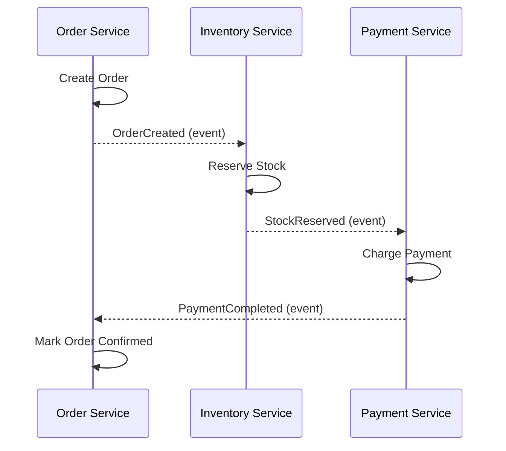
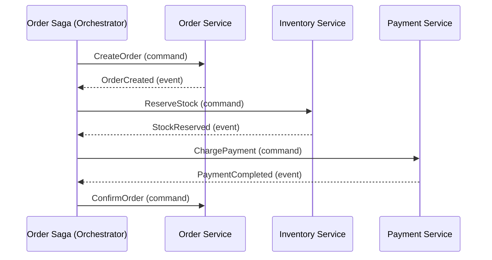
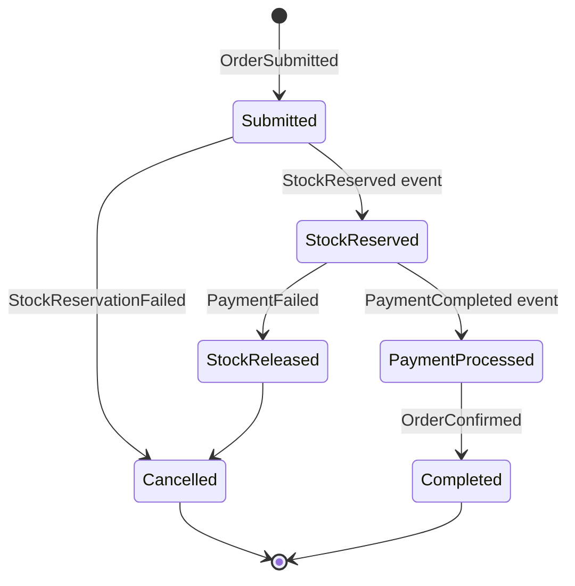
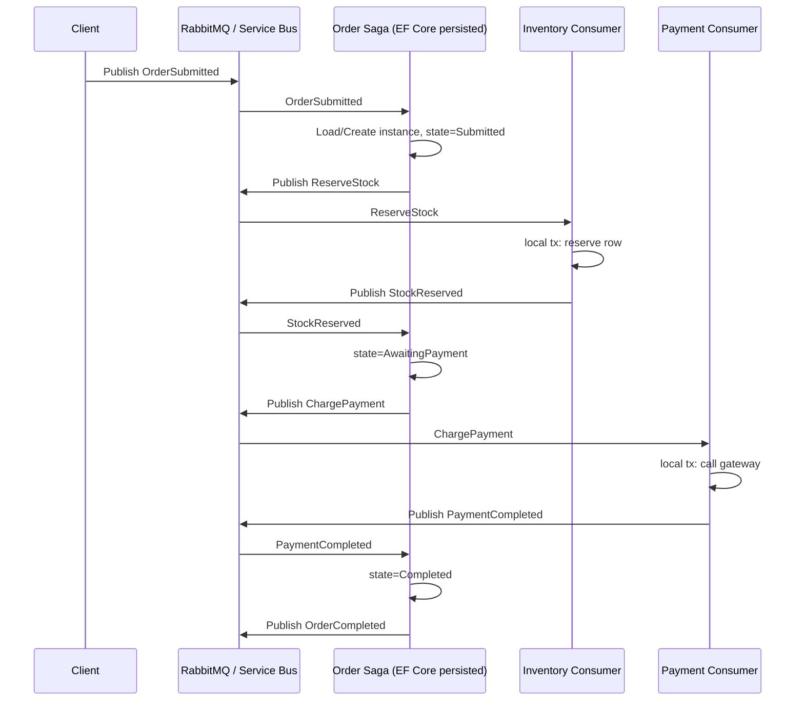
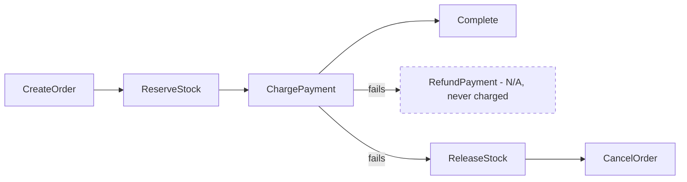
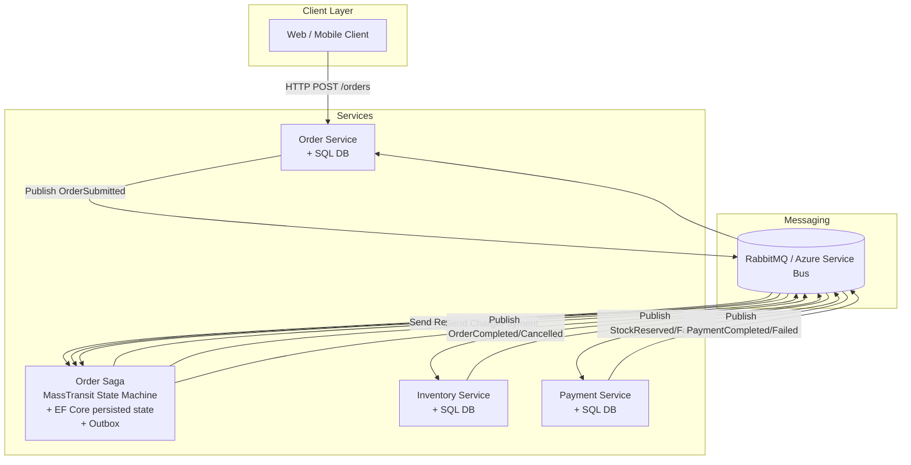

# The Saga Pattern in .NET — A Complete Guide

**Audience:** Beginner to Advanced .NET Developers
**Stack:** .NET, C#, MassTransit, RabbitMQ, Azure Service Bus, EF Core, Microservices

---

## Table of Contents

1. Introduction
2. Beginner Level: What Problem Does Saga Solve?
3. Why Use Saga in a .NET Project?
4. Saga Types: Choreography vs Orchestration
5. Important Concepts
6. Beginner Example: Order Saga Concept
7. Intermediate Level: Implementing Saga in .NET with MassTransit
8. Define Messages
9. Define the Saga State
10. Define the Saga State Machine
11. Create Consumers for Each Service
12. Simple In-Memory Setup for Learning
13. Production Setup with RabbitMQ
14. Advanced Level: Persisting Saga State with EF Core
15. Understanding the Message Flow
16. Commands vs Events in a Saga
17. Compensation Design
18. Advanced Topic: Idempotency
19. Advanced Topic: Timeouts
20. Advanced Topic: Outbox Pattern
21. Advanced Topic: Retries and Error Handling
22. Advanced Topic: Correlation
23. Advanced Topic: Saga State Should Be Small
24. Advanced Topic: Testing Sagas
25. Advanced Topic: Choreography Example
26. Advanced Topic: Orchestration Best Practices
27. Advanced Topic: Choosing a .NET Saga Framework
28. Saga vs Process Manager
29. Common Mistakes
30. Practical Architecture Example
31. When to Use Saga in Modular Monolith
32. Summary: Why Saga Is Used in .NET
33. Summary: How to Use Saga in .NET
34. Final Recommendation

---

## 1. Introduction

When you split a monolith into microservices, you gain independent deployability and scalability — but you lose something you had for free before: **the database transaction**.

In a monolith, an operation like "place an order" could be wrapped in a single `BEGIN TRANSACTION ... COMMIT` block across Orders, Inventory, and Payments tables. If anything failed, the whole thing rolled back atomically.

In a microservices world, Orders, Inventory, and Payments are **separate services with separate databases**. There is no shared transaction. You cannot do a two-phase commit across services in any practical, scalable way (2PC exists in theory, but it doesn't hold up under real-world availability and latency requirements).

The **Saga pattern** is the accepted answer to this problem: instead of one atomic transaction, you break the business process into a sequence of **local transactions**, each of which publishes an event or command that triggers the next step. If a step fails, the saga runs **compensating actions** to undo the work already done — not by rolling back a database transaction, but by explicitly reversing business effects (e.g., "release the inventory that was reserved").

This guide walks from the conceptual "what problem does this solve" through to production-grade implementations in .NET using **MassTransit**, backed by **RabbitMQ** or **Azure Service Bus**, with state persisted in **EF Core**.

---

## 2. Beginner Level: What Problem Does Saga Solve?

Imagine an e-commerce checkout that involves three independent services:

- **Order Service** — creates the order
- **Inventory Service** — reserves stock
- **Payment Service** — charges the customer

In a monolith with one database, this is trivial:

```csharp
using var transaction = await db.Database.BeginTransactionAsync();
CreateOrder();
ReserveInventory();
ChargePayment();
await transaction.CommitAsync(); // all or nothing
```

Once these become three services with three databases, that guarantee disappears. If `ChargePayment()` fails, the order was already created and the inventory was already reserved in *different* databases that know nothing about each other's transaction.

You now face a distributed data consistency problem:

- You cannot lock all three databases together.
- You cannot roll back a commit that already happened in another service.
- Network calls can fail, time out, or succeed without the caller ever knowing.

**Saga solves this by replacing one big atomic transaction with a series of smaller local transactions plus explicit compensation logic**, coordinated either by the services themselves (choreography) or by a central coordinator (orchestration).

```
Monolith:  [ Create Order + Reserve Stock + Charge Payment ]  <- one ACID transaction
Microservices (Saga):
  [ Create Order ] -> [ Reserve Stock ] -> [ Charge Payment ]
        |                    |                    |
   local tx only        local tx only        local tx only
        |                    |                    |
   compensate <---------- compensate <-------- failure
   (cancel order)      (release stock)
```

---

## 3. Why Use Saga in a .NET Project?

In the .NET ecosystem, Saga typically comes up once a system:

- Is built (or being migrated) as **microservices** communicating via message brokers (RabbitMQ, Azure Service Bus, Amazon SQS).
- Has business processes that **span multiple bounded contexts** — order fulfillment, subscription billing, travel booking, loan approval, etc.
- Needs **eventual consistency** instead of strict ACID consistency across services.
- Wants **resilience**: if Payment Service is briefly down, the process should retry or compensate gracefully instead of hanging or corrupting data.

Reasons teams specifically reach for Saga in .NET:

| Driver | Explanation |
|---|---|
| No distributed transactions | .NET has no safe, scalable 2PC across independent SQL Server / Postgres instances |
| Message-driven architecture | .NET has first-class message broker support (MassTransit, NServiceBus, Azure SDKs) |
| Long-running processes | Some workflows take minutes, hours, or days (e.g., waiting for a bank confirmation) |
| Auditability | Saga state gives you a natural audit trail of what happened and when |
| Failure isolation | A failure in one service doesn't corrupt state in another — it triggers compensation instead |

Saga is not "for microservices only" — it is also useful **inside a modular monolith** when different modules own different data and must not directly touch each other's tables (see Section 31).

---

## 4. Saga Types: Choreography vs Orchestration

There are two fundamentally different ways to coordinate a saga.

### Choreography

Each service publishes events. Other services subscribe to those events and react — there is no central coordinator. Each service knows what to do when it hears something happened.



**Pros:** simple to start, no single point of coordination logic, services stay decoupled.
**Cons:** as the number of steps grows, the overall flow becomes implicit and hard to see — it's scattered across every service's event handlers. Debugging "why did this order get stuck" means jumping between five codebases.

### Orchestration

A central **Saga Orchestrator** (a state machine) explicitly tells each service what to do next, and listens for the result.



**Pros:** the entire business process lives in one place (the state machine) — easy to reason about, easy to test, easy to visualize.
**Cons:** the orchestrator becomes a critical component; it needs to be resilient and correctly persisted itself.

### Which one does the .NET ecosystem favor?

For anything beyond 2–3 steps, **orchestration is strongly preferred** in .NET, mainly because **MassTransit's Saga State Machine** (built on the Automatonymous-derived DSL) makes orchestration explicit, strongly typed, and testable. This guide will focus primarily on orchestration, with a choreography example in Section 25 for comparison.

| | Choreography | Orchestration |
|---|---|---|
| Coordination | Distributed across services | Centralized in one state machine |
| Visibility of flow | Low — scattered | High — one file/class |
| Coupling | Services coupled via events only | Services coupled to orchestrator commands |
| Best for | 2–3 simple steps | Complex, multi-step, branching workflows |
| .NET tooling | MassTransit consumers + pub/sub | MassTransit `MassTransitStateMachine<T>` |

---

## 5. Important Concepts

Before writing code, these terms will come up constantly:

- **Saga** — the overall, long-running business transaction spanning multiple services.
- **Saga Instance / Saga State** — the persisted data representing where a *specific* saga (e.g., order #1234) currently is in its lifecycle.
- **Correlation ID** — the value (usually a `Guid`, often the order ID) used to match incoming messages to the correct saga instance.
- **Command** — a message that tells a service to *do something* (imperative, one recipient — e.g., `ReserveStock`).
- **Event** — a message that announces *something happened* (past tense, many possible subscribers — e.g., `StockReserved`).
- **Compensating Transaction** — an action that semantically undoes a previously completed step (not a database rollback — e.g., `ReleaseStock` to undo `ReserveStock`).
- **State Machine** — the formal definition of states (`Submitted`, `StockReserved`, `Completed`, `Failed`) and the transitions between them triggered by events.
- **Idempotency** — the property that processing the same message twice has the same effect as processing it once (critical because message brokers guarantee *at-least-once* delivery, not *exactly-once*).
- **Outbox Pattern** — a technique to atomically persist a database change and the message that announces it, avoiding "DB updated but event never published" bugs.

---

## 6. Beginner Example: Order Saga Concept

Before touching any framework, think through the **Order Saga** purely as a flowchart. This is the mental model every implementation below maps onto.



Plain English walkthrough:

1. Customer submits an order → **Order Saga starts**, state = `Submitted`.
2. Saga asks Inventory Service to reserve stock.
   - If stock is available → state = `StockReserved`.
   - If not → compensate: cancel the order → state = `Cancelled`.
3. Saga asks Payment Service to charge the customer.
   - If payment succeeds → state = `PaymentProcessed`.
   - If payment fails → compensate: release the previously reserved stock → then cancel the order.
4. Saga confirms the order → state = `Completed`.

Notice: **every forward step has a corresponding backward (compensating) step.** This symmetry is the core design discipline of Saga — for every command you send, ask "what do I send to undo this if a later step fails?"

---

## 7. Intermediate Level: Implementing Saga in .NET with MassTransit

**MassTransit** is the de facto standard library for building message-based systems in .NET, and it has first-class saga support via `MassTransitStateMachine<TInstance>`. It abstracts over the underlying broker (RabbitMQ, Azure Service Bus, Amazon SQS, or in-memory for testing), so the saga logic you write doesn't change when you swap brokers.

Install the packages:

```bash
dotnet add package MassTransit
dotnet add package MassTransit.RabbitMQ
dotnet add package MassTransit.EntityFrameworkCore
```

The pieces we need to build, in order:

1. **Messages** (commands/events) — Section 8
2. **Saga State** (the persisted instance) — Section 9
3. **Saga State Machine** (the orchestration logic) — Section 10
4. **Consumers** in each downstream service — Section 11
5. **Bus configuration** — in-memory first (Section 12), then RabbitMQ (Section 13)

---

## 8. Define Messages

Messages are plain C# records/classes. Keep a clear naming convention: **commands are imperative verbs**, **events are past-tense facts**.

```csharp
namespace OrderSaga.Contracts;

// ---------- Commands (tell a service what to do) ----------
public record SubmitOrder(Guid OrderId, Guid CustomerId, decimal Amount);
public record ReserveStock(Guid OrderId, string Sku, int Quantity);
public record ReleaseStock(Guid OrderId, string Sku, int Quantity);
public record ChargePayment(Guid OrderId, Guid CustomerId, decimal Amount);
public record RefundPayment(Guid OrderId, decimal Amount);

// ---------- Events (announce what happened) ----------
public record OrderSubmitted(Guid OrderId, Guid CustomerId, decimal Amount);
public record StockReserved(Guid OrderId);
public record StockReservationFailed(Guid OrderId, string Reason);
public record PaymentCompleted(Guid OrderId);
public record PaymentFailed(Guid OrderId, string Reason);
public record OrderCompleted(Guid OrderId);
public record OrderCancelled(Guid OrderId, string Reason);
```

Put these in a shared `Contracts` class library referenced by every service — the saga project and all the consumer projects (Order, Inventory, Payment). This is the *only* thing services should share; never share business logic or database entities across service boundaries.

---

## 9. Define the Saga State

The saga state is what gets persisted between steps. MassTransit requires it to implement `SagaStateMachineInstance`, which just means it needs a `Guid CorrelationId`.

```csharp
using MassTransit;

namespace OrderSaga.StateMachine;

public class OrderSagaState : SagaStateMachineInstance, ISagaVersion
{
    public Guid CorrelationId { get; set; } // matches OrderId
    public int Version { get; set; }        // used for optimistic concurrency (EF Core)

    // Business data needed across steps — keep this MINIMAL (see Section 23)
    public Guid CustomerId { get; set; }
    public decimal Amount { get; set; }
    public string CurrentState { get; set; } = default!; // required by EF Core persistence

    // Bookkeeping for compensation decisions
    public bool StockWasReserved { get; set; }
    public bool PaymentWasCharged { get; set; }

    public DateTime CreatedAt { get; set; }
    public DateTime? CompletedAt { get; set; }
}
```

`CurrentState` is a string column MassTransit uses internally to track which state (`Submitted`, `StockReserved`, etc.) the instance is in when using EF Core persistence.

---

## 10. Define the Saga State Machine

This is the heart of orchestration. You declare **states**, **events**, and how each event moves the instance from one state to another — plus what side effects (publishing commands) happen along the way.

```csharp
using MassTransit;
using OrderSaga.Contracts;

namespace OrderSaga.StateMachine;

public class OrderStateMachine : MassTransitStateMachine<OrderSagaState>
{
    // States
    public State Submitted { get; private set; } = default!;
    public State AwaitingStock { get; private set; } = default!;
    public State AwaitingPayment { get; private set; } = default!;
    public State Completed { get; private set; } = default!;
    public State Cancelled { get; private set; } = default!;

    // Events (correlated to the saga instance by OrderId)
    public Event<OrderSubmitted> OrderSubmittedEvent { get; private set; } = default!;
    public Event<StockReserved> StockReservedEvent { get; private set; } = default!;
    public Event<StockReservationFailed> StockReservationFailedEvent { get; private set; } = default!;
    public Event<PaymentCompleted> PaymentCompletedEvent { get; private set; } = default!;
    public Event<PaymentFailed> PaymentFailedEvent { get; private set; } = default!;

    public OrderStateMachine()
    {
        InstanceState(x => x.CurrentState);

        // Tell MassTransit which property on the message correlates to CorrelationId
        Event(() => OrderSubmittedEvent, x => x.CorrelateById(m => m.Message.OrderId));
        Event(() => StockReservedEvent, x => x.CorrelateById(m => m.Message.OrderId));
        Event(() => StockReservationFailedEvent, x => x.CorrelateById(m => m.Message.OrderId));
        Event(() => PaymentCompletedEvent, x => x.CorrelateById(m => m.Message.OrderId));
        Event(() => PaymentFailedEvent, x => x.CorrelateById(m => m.Message.OrderId));

        Initially(
            When(OrderSubmittedEvent)
                .Then(ctx =>
                {
                    ctx.Saga.CustomerId = ctx.Message.CustomerId;
                    ctx.Saga.Amount = ctx.Message.Amount;
                    ctx.Saga.CreatedAt = DateTime.UtcNow;
                })
                .Publish(ctx => new ReserveStock(ctx.Saga.CorrelationId, "SKU-DEFAULT", 1))
                .TransitionTo(AwaitingStock)
        );

        During(AwaitingStock,
            When(StockReservedEvent)
                .Then(ctx => ctx.Saga.StockWasReserved = true)
                .Publish(ctx => new ChargePayment(ctx.Saga.CorrelationId, ctx.Saga.CustomerId, ctx.Saga.Amount))
                .TransitionTo(AwaitingPayment),

            When(StockReservationFailedEvent)
                .Publish(ctx => new OrderCancelled(ctx.Saga.CorrelationId, ctx.Message.Reason))
                .TransitionTo(Cancelled)
                .Finalize()
        );

        During(AwaitingPayment,
            When(PaymentCompletedEvent)
                .Then(ctx =>
                {
                    ctx.Saga.PaymentWasCharged = true;
                    ctx.Saga.CompletedAt = DateTime.UtcNow;
                })
                .Publish(ctx => new OrderCompleted(ctx.Saga.CorrelationId))
                .TransitionTo(Completed)
                .Finalize(),

            // Compensation path: payment failed AFTER stock was reserved
            When(PaymentFailedEvent)
                .Publish(ctx => new ReleaseStock(ctx.Saga.CorrelationId, "SKU-DEFAULT", 1))
                .Publish(ctx => new OrderCancelled(ctx.Saga.CorrelationId, ctx.Message.Reason))
                .TransitionTo(Cancelled)
                .Finalize()
        );

        SetCompletedWhenFinalized();
    }
}
```

Notice how directly this maps to the flowchart in Section 6 — that mapping is exactly the point of orchestration: **the code reads like the business process**.

---

## 11. Create Consumers for Each Service

Each downstream service consumes commands and replies with events. These live in the **owning service**, not in the saga project.

**Inventory Service:**

```csharp
using MassTransit;
using OrderSaga.Contracts;

public class ReserveStockConsumer : IConsumer<ReserveStock>
{
    private readonly IInventoryRepository _repo;
    public ReserveStockConsumer(IInventoryRepository repo) => _repo = repo;

    public async Task Consume(ConsumeContext<ReserveStock> context)
    {
        var msg = context.Message;
        var available = await _repo.TryReserveAsync(msg.Sku, msg.Quantity, msg.OrderId);

        if (available)
            await context.Publish(new StockReserved(msg.OrderId));
        else
            await context.Publish(new StockReservationFailed(msg.OrderId, "Insufficient stock"));
    }
}

public class ReleaseStockConsumer : IConsumer<ReleaseStock>
{
    private readonly IInventoryRepository _repo;
    public ReleaseStockConsumer(IInventoryRepository repo) => _repo = repo;

    public Task Consume(ConsumeContext<ReleaseStock> context) =>
        _repo.ReleaseAsync(context.Message.Sku, context.Message.Quantity, context.Message.OrderId);
}
```

**Payment Service:**

```csharp
public class ChargePaymentConsumer : IConsumer<ChargePayment>
{
    private readonly IPaymentGateway _gateway;
    public ChargePaymentConsumer(IPaymentGateway gateway) => _gateway = gateway;

    public async Task Consume(ConsumeContext<ChargePayment> context)
    {
        var msg = context.Message;
        var result = await _gateway.ChargeAsync(msg.CustomerId, msg.Amount, idempotencyKey: msg.OrderId.ToString());

        if (result.Success)
            await context.Publish(new PaymentCompleted(msg.OrderId));
        else
            await context.Publish(new PaymentFailed(msg.OrderId, result.ErrorMessage));
    }
}
```

Each consumer does exactly one local transaction and reports back a single event. It never calls another service directly — that coordination logic belongs entirely to the saga.

---

## 12. Simple In-Memory Setup for Learning

For local development, tests, or a first proof of concept, MassTransit's in-memory transport avoids standing up a broker entirely.

```csharp
var builder = Host.CreateApplicationBuilder(args);

builder.Services.AddMassTransit(x =>
{
    x.AddSagaStateMachine<OrderStateMachine, OrderSagaState>()
        .InMemoryRepository(); // saga state kept in memory — fine for demos/tests

    x.AddConsumer<ReserveStockConsumer>();
    x.AddConsumer<ReleaseStockConsumer>();
    x.AddConsumer<ChargePaymentConsumer>();

    x.UsingInMemory((context, cfg) =>
    {
        cfg.ConfigureEndpoints(context);
    });
});

var host = builder.Build();
await host.RunAsync();
```

This is enough to publish an `OrderSubmitted` event and watch the entire saga run end-to-end in a console app or unit test, with zero infrastructure.

---

## 13. Production Setup with RabbitMQ

Swap the transport, keep everything else the same — this is the payoff of MassTransit's abstraction.

```csharp
builder.Services.AddMassTransit(x =>
{
    x.AddSagaStateMachine<OrderStateMachine, OrderSagaState>()
        .EntityFrameworkRepository(r =>
        {
            r.ExistingDbContext<OrderSagaDbContext>();
            r.ConcurrencyMode = ConcurrencyMode.Optimistic; // uses OrderSagaState.Version
        });

    x.AddConsumer<ReserveStockConsumer>();
    x.AddConsumer<ChargePaymentConsumer>();

    x.UsingRabbitMq((context, cfg) =>
    {
        cfg.Host("rabbitmq://localhost", h =>
        {
            h.Username("guest");
            h.Password("guest");
        });

        cfg.ConfigureEndpoints(context); // auto-creates queues per consumer/saga
    });
});
```

For **Azure Service Bus** instead of RabbitMQ:

```csharp
builder.Services.AddMassTransit(x =>
{
    x.AddSagaStateMachine<OrderStateMachine, OrderSagaState>()
        .EntityFrameworkRepository(r => r.ExistingDbContext<OrderSagaDbContext>());

    x.UsingAzureServiceBus((context, cfg) =>
    {
        cfg.Host("Endpoint=sb://your-namespace.servicebus.windows.net/;...");
        cfg.ConfigureEndpoints(context);
    });
});
```

The saga state machine (Section 10) and consumers (Section 11) don't change at all between transports — only the `UsingX(...)` configuration block does.

---

## 14. Advanced Level: Persisting Saga State with EF Core

In-memory storage loses everything on restart, so production sagas persist state — normally via EF Core.

```csharp
public class OrderSagaDbContext : DbContext
{
    public OrderSagaDbContext(DbContextOptions<OrderSagaDbContext> options) : base(options) { }

    public DbSet<OrderSagaState> OrderSagas => Set<OrderSagaState>();

    protected override void OnModelCreating(ModelBuilder modelBuilder)
    {
        modelBuilder.Entity<OrderSagaState>(b =>
        {
            b.HasKey(x => x.CorrelationId);
            b.Property(x => x.CurrentState).HasMaxLength(64);
            b.Property(x => x.Version).IsRowVersion(); // optimistic concurrency token
        });
    }
}
```

```csharp
builder.Services.AddDbContext<OrderSagaDbContext>(opt =>
    opt.UseSqlServer(connectionString));
```

Run a migration as usual:

```bash
dotnet ef migrations add InitOrderSaga
dotnet ef database update
```

**Why `Version` / row version matters:** two messages for the *same* saga instance can arrive concurrently (e.g., a retry racing the original). Optimistic concurrency via a row version column ensures MassTransit detects the conflict and retries the state transition safely rather than silently overwriting one update with another.

---

## 15. Understanding the Message Flow

Put together, here is the full round trip for one order, including the broker:



Every arrow into and out of the broker is a **separate local transaction**. Nothing here is atomic across the whole diagram — consistency is achieved *eventually*, through the sequence of steps and, when necessary, compensations.

---

## 16. Commands vs Events in a Saga

This distinction trips up almost every beginner, so it's worth stating precisely:

| | Command | Event |
|---|---|---|
| Tense | Imperative ("ReserveStock") | Past tense ("StockReserved") |
| Intent | "Do this" | "This happened" |
| Recipients | Exactly one (the owning service) | Zero or many subscribers |
| Sent by | The saga/orchestrator | The service that did the work |
| Failure semantics | Can be rejected/faulted | Is a fact — cannot be "rejected" |

In MassTransit terms: commands are usually sent with `Send` (routed to a specific queue), while events are `Publish`ed (fanned out to a topic/exchange that any interested consumer can subscribe to). In orchestration, the saga typically **sends commands** and **subscribes to events** — that asymmetry is what keeps the orchestrator in control while still letting services stay decoupled from each other.

---

## 17. Compensation Design

Compensation is not a database rollback — it's a **new forward-moving business action** that reverses the effect of a previous one. Design it explicitly, per step, before writing any code:

| Forward step | Compensating step |
|---|---|
| `ReserveStock` | `ReleaseStock` |
| `ChargePayment` | `RefundPayment` |
| `CreateOrder` | `CancelOrder` |
| `SendConfirmationEmail` | *(often no compensation needed — some steps are not compensable)* |

Two important nuances:

1. **Not every step needs (or can have) a compensation.** Sending an email can't be "un-sent" — at best you send a follow-up "disregard the previous email" message. Design each step by asking: *is this reversible, and if not, is that acceptable?*
2. **Compensations must run in reverse order of completed steps**, not all steps. If stock was reserved but payment was never attempted, you only release stock — you don't try to refund a payment that never happened. This is exactly why `OrderSagaState` tracks booleans like `StockWasReserved` (Section 9) — the saga needs to know *what actually completed* to know what to undo.



---

## 18. Advanced Topic: Idempotency

Message brokers guarantee **at-least-once delivery** — never exactly-once. Your saga *will* receive duplicate messages eventually (broker redelivery after a slow ack, consumer restart mid-processing, network retry, etc.). Every consumer and every state transition must tolerate being invoked twice with the same message.

Two layers of defense:

**1. State machine level** — MassTransit's state machine naturally provides some idempotency: an event that doesn't match a valid transition for the current state is simply ignored (or routed to `Ignore()` if you configure it explicitly).

```csharp
During(Completed,
    // A duplicate PaymentCompleted arriving after we're already done — ignore it
    Ignore(PaymentCompletedEvent)
);
```

**2. Consumer/business level** — When calling external systems (a payment gateway), pass a stable idempotency key (the `OrderId`, as shown in Section 11's `ChargePaymentConsumer`) so the gateway itself de-duplicates the charge even if your consumer runs twice.

```csharp
var result = await _gateway.ChargeAsync(
    msg.CustomerId,
    msg.Amount,
    idempotencyKey: msg.OrderId.ToString()); // gateway won't double-charge
```

For database writes, use a natural unique constraint (e.g., unique index on `(OrderId, Sku)` for a reservation table) so a duplicate insert throws instead of silently double-reserving stock.

---

## 19. Advanced Topic: Timeouts

Real-world steps don't always respond. A saga that waits forever for `PaymentCompleted` will leak stuck orders. MassTransit state machines support built-in **schedule/timeout** support via `Schedule`.

```csharp
public Schedule<OrderSagaState, PaymentTimeoutExpired> PaymentTimeout { get; private set; } = default!;

public OrderStateMachine()
{
    Schedule(() => PaymentTimeout, x => x.PaymentTimeoutTokenId, s =>
    {
        s.Delay = TimeSpan.FromMinutes(10);
        s.Received = r => r.CorrelateById(ctx => ctx.Message.OrderId);
    });

    During(AwaitingPayment,
        When(PaymentTimeout.Received)
            .Publish(ctx => new ReleaseStock(ctx.Saga.CorrelationId, "SKU-DEFAULT", 1))
            .Publish(ctx => new OrderCancelled(ctx.Saga.CorrelationId, "Payment timed out"))
            .TransitionTo(Cancelled)
            .Finalize()
    );

    During(AwaitingStock,
        When(OrderSubmittedEvent)
            .Schedule(PaymentTimeout, ctx => new PaymentTimeoutExpired(ctx.Saga.CorrelationId))
    );
}
```

`PaymentTimeoutTokenId` (a `Guid?` on `OrderSagaState`) lets MassTransit cancel the scheduled timeout automatically if `PaymentCompleted` arrives first — you don't have to manage that cancellation yourself.

---

## 20. Advanced Topic: Outbox Pattern

Here's a subtle bug that bites teams new to sagas: a consumer writes to its database *and then* publishes an event. If the process crashes between those two steps, the database change happened but the event never went out — the saga stalls forever, silently.

The **Outbox Pattern** fixes this by writing the outgoing message to a table **in the same local database transaction** as the business data change, then a background dispatcher reads that table and actually publishes to the broker.

```csharp
builder.Services.AddMassTransit(x =>
{
    x.AddEntityFrameworkOutbox<AppDbContext>(o =>
    {
        o.QueryDelay = TimeSpan.FromSeconds(1);
        o.UseSqlServer();
        o.UseBusOutbox(); // ensures publish only happens after the DB tx commits
    });

    // ... sagas / consumers
});
```

```csharp
public class ReserveStockConsumer : IConsumer<ReserveStock>
{
    private readonly InventoryDbContext _db;
    public ReserveStockConsumer(InventoryDbContext db) => _db = db;

    public async Task Consume(ConsumeContext<ReserveStock> context)
    {
        _db.Reservations.Add(new Reservation(context.Message.OrderId, context.Message.Sku));
        await _db.SaveChangesAsync(); // reservation row + outbox message committed together

        await context.Publish(new StockReserved(context.Message.OrderId));
        // this Publish call is intercepted and stored in the outbox table by MassTransit,
        // then dispatched only after SaveChangesAsync succeeds
    }
}
```

This guarantees: **if the database write succeeded, the event will eventually be published — and if the database write failed, the event never goes out.** That atomicity is what makes sagas reliable in the face of crashes.

---

## 21. Advanced Topic: Retries and Error Handling

Two different kinds of failure need two different responses:

- **Transient failure** (network blip, DB deadlock, brief service unavailability) → **retry**.
- **Business failure** (insufficient stock, declined card) → **not a retry** — it's a valid outcome that should trigger compensation.

Configure retries at the receive endpoint level for transient failures:

```csharp
cfg.ReceiveEndpoint("reserve-stock-queue", e =>
{
    e.UseMessageRetry(r => r.Exponential(
        retryLimit: 5,
        minInterval: TimeSpan.FromSeconds(1),
        maxInterval: TimeSpan.FromSeconds(30),
        intervalDelta: TimeSpan.FromSeconds(2)));

    e.ConfigureConsumer<ReserveStockConsumer>(context);
});
```

After retries are exhausted, MassTransit moves the message to an `_error` queue automatically — this is your dead-letter queue. Monitor it; a growing error queue is an operational signal, not something to ignore.

For **business failures**, don't throw an exception and let the retry pipeline eat it — publish the explicit failure event (`StockReservationFailed`) so the saga can transition into compensation immediately, without wasting retries on something retrying will never fix.

```csharp
if (!available)
{
    // NOT a transient failure — publish the fact immediately, don't retry
    await context.Publish(new StockReservationFailed(msg.OrderId, "Insufficient stock"));
    return; // consumer completes successfully — this IS the correct outcome
}
```

---

## 22. Advanced Topic: Correlation

Correlation is how MassTransit knows *which* saga instance a given message belongs to. Get this wrong and messages either create phantom new saga instances or silently get dropped.

```csharp
Event(() => StockReservedEvent, x => x.CorrelateById(m => m.Message.OrderId));
```

Rules of thumb:

- Pick **one stable ID** at the start of the saga (usually the business entity's ID — `OrderId`) and thread it through **every** message in the flow.
- If a message doesn't carry the correlation ID directly (e.g., a webhook callback from a third-party payment provider that only returns *its own* transaction ID), maintain an explicit mapping table (`ExternalTransactionId -> OrderId`) and translate before publishing into the saga.
- For the *first* event that creates a new instance, MassTransit needs `.SelectId(...)` if the correlation ID isn't already the message's natural key:

```csharp
Event(() => OrderSubmittedEvent, x =>
{
    x.CorrelateById(m => m.Message.OrderId);
    x.InsertOnInitial = true; // create a new saga instance for unmatched OrderSubmitted messages
});
```

---

## 23. Advanced Topic: Saga State Should Be Small

A saga instance is loaded, deserialized, and persisted on **every single transition**. Treat it like a lightweight coordination record, not a data warehouse.

**Don't do this:**

```csharp
public class OrderSagaState : SagaStateMachineInstance
{
    public Guid CorrelationId { get; set; }
    public List<OrderLineItem> LineItems { get; set; } = new(); // ❌ full order details
    public CustomerProfile Customer { get; set; } = default!;   // ❌ entire customer object
    public List<AuditLogEntry> History { get; set; } = new();   // ❌ unbounded growth
}
```

**Do this instead** — keep only what's needed to make routing/compensation decisions, and let each service own its own detailed data:

```csharp
public class OrderSagaState : SagaStateMachineInstance
{
    public Guid CorrelationId { get; set; }
    public Guid CustomerId { get; set; }      // reference, not the full object
    public decimal Amount { get; set; }       // needed for ChargePayment/RefundPayment
    public bool StockWasReserved { get; set; }
    public bool PaymentWasCharged { get; set; }
    public string CurrentState { get; set; } = default!;
}
```

If you need the full order history later (for support/audit purposes), query it from the Order Service's own database — don't duplicate it into the saga table "just in case."

---

## 24. Advanced Topic: Testing Sagas

MassTransit ships a test harness that runs the entire bus in-memory, letting you assert on saga state transitions without any real broker.

```csharp
[Fact]
public async Task Order_completes_when_stock_and_payment_succeed()
{
    await using var provider = new ServiceCollection()
        .AddMassTransitTestHarness(x =>
        {
            x.AddSagaStateMachine<OrderStateMachine, OrderSagaState>()
                .InMemoryRepository();
        })
        .BuildServiceProvider(true);

    var harness = provider.GetRequiredService<ITestHarness>();
    await harness.Start();

    var orderId = Guid.NewGuid();

    await harness.Bus.Publish(new OrderSubmitted(orderId, Guid.NewGuid(), 100m));
    Assert.True(await harness.Published.Any<ReserveStock>());

    await harness.Bus.Publish(new StockReserved(orderId));
    Assert.True(await harness.Published.Any<ChargePayment>());

    await harness.Bus.Publish(new PaymentCompleted(orderId));
    Assert.True(await harness.Published.Any<OrderCompleted>());

    var sagaHarness = provider.GetRequiredService<ISagaStateMachineTestHarness<OrderStateMachine, OrderSagaState>>();
    var instance = sagaHarness.Created.ContainsInState(orderId, sagaHarness.StateMachine,
        sagaHarness.StateMachine.Completed);

    Assert.NotNull(instance);
}
```

Write at minimum: one **happy path** test, one test per **compensation branch**, and one **duplicate message** test to confirm idempotent handling (Section 18).

---

## 25. Advanced Topic: Choreography Example

For comparison, here is the same Order flow implemented as pure choreography — no central saga, just consumers reacting to each other's events.

```csharp
// In Inventory Service
public class OrderSubmittedConsumer : IConsumer<OrderSubmitted>
{
    public async Task Consume(ConsumeContext<OrderSubmitted> context)
    {
        var reserved = await TryReserve(context.Message.OrderId);
        if (reserved)
            await context.Publish(new StockReserved(context.Message.OrderId));
        else
            await context.Publish(new StockReservationFailed(context.Message.OrderId, "No stock"));
    }
}

// In Payment Service
public class StockReservedConsumer : IConsumer<StockReserved>
{
    public async Task Consume(ConsumeContext<StockReserved> context)
    {
        var success = await Charge(context.Message.OrderId);
        if (success)
            await context.Publish(new PaymentCompleted(context.Message.OrderId));
        else
        {
            await context.Publish(new PaymentFailed(context.Message.OrderId, "Declined"));
            // Payment service has to know to tell Inventory to release stock —
            // this cross-service knowledge is choreography's main downside
            await context.Publish(new ReleaseStockRequested(context.Message.OrderId));
        }
    }
}

// Back in Inventory Service, listening yet again
public class ReleaseStockRequestedConsumer : IConsumer<ReleaseStockRequested>
{
    public Task Consume(ConsumeContext<ReleaseStockRequested> context) =>
        Release(context.Message.OrderId);
}

// In Order Service
public class PaymentCompletedConsumer : IConsumer<PaymentCompleted>
{
    public Task Consume(ConsumeContext<PaymentCompleted> context) =>
        MarkOrderComplete(context.Message.OrderId);
}
```

Compare this to Section 10: the *entire* business process here is invisible unless you read four separate files across three separate services. This is exactly why orchestration wins once a process has more than a couple of steps.

---

## 26. Advanced Topic: Orchestration Best Practices

- **One state machine per business process**, not per entity type — `OrderStateMachine`, not `OrderStateMachine` + `LineItemStateMachine` unless line items genuinely have independent lifecycles.
- **Keep the state machine free of business logic** beyond routing decisions — `.Then(...)` blocks should set flags and simple fields, not compute pricing or call external HTTP APIs directly. Delegate real work to consumers.
- **Every `During(...)` block should explicitly handle or `Ignore()` every event** that could plausibly arrive in that state — an unhandled event in MassTransit throws a fault by default, so be deliberate.
- **Version your saga state machine carefully.** Once instances exist in production, adding new states/events is safe; removing or renaming existing ones can strand in-flight instances. Consider migrations or draining before deploying breaking changes.
- **Emit domain events from the orchestrator**, not just commands, so other systems (analytics, notifications) can observe saga progress without being coupled to it.

---

## 27. Advanced Topic: Choosing a .NET Saga Framework

| Framework | Style | Notes |
|---|---|---|
| **MassTransit** | Orchestration (state machine) + choreography (plain consumers) | Most widely adopted in .NET; broker-agnostic; strong EF Core saga persistence; the default recommendation for most teams |
| **NServiceBus** | Orchestration (Saga class) | Mature commercial product, excellent tooling and support, license cost for production use |
| **Elsa Workflows** | Visual/code workflow engine, broader than sagas | Good fit if you want a designer UI and general workflow needs beyond just sagas |
| **Roll your own** | Manual state column + polling/outbox | Viable for 1–2 simple sagas; becomes a maintenance burden as the number of processes grows |

For the vast majority of .NET microservice systems, **MassTransit is the pragmatic default** — it's open source, actively maintained, integrates cleanly with RabbitMQ/Azure Service Bus/Amazon SQS, and its state machine DSL is purpose-built for exactly this problem.

---

## 28. Saga vs Process Manager

These terms are often used interchangeably, but there's a useful technical distinction:

- A **Saga** (in the strict, original sense from the 1987 Garcia-Molina/Salem paper) is specifically about **coordinating a sequence of local transactions with compensations** — the focus is on data consistency across steps.
- A **Process Manager** (from Enterprise Integration Patterns) is a broader concept: it **maintains state and routes messages based on business logic**, and *may or may not* involve compensation. A process manager might, for example, wait for three independent approvals in any order before proceeding — there's no rollback concept there, just routing state.

In practice, **MassTransit's `MassTransitStateMachine<T>` implements the Process Manager pattern**, and teams use it to build sagas *(the specific case where compensation matters)* as well as general long-running workflows *(where compensation isn't the point)*. Don't get hung up on the terminology in day-to-day work — but understand it if you're reading academic sources or comparing frameworks, since some frameworks explicitly market themselves as "process manager" tools rather than "saga" tools.

---

## 29. Common Mistakes

1. **Sharing a database across services "just for the saga."** Defeats the entire purpose — if services share a DB, use a real transaction instead of a saga.
2. **Forgetting compensations for a subset of steps.** Every forward step needs a considered answer to "what if this succeeded but a later step failed?" — even if the answer is "nothing to compensate."
3. **Publishing events before the local transaction commits.** Without the Outbox Pattern (Section 20), a crash between DB write and publish silently breaks the saga.
4. **Treating business failures as exceptions.** A declined payment is not a bug — publish `PaymentFailed` as a normal event, don't throw and trigger the retry pipeline for something retries can't fix.
5. **Ignoring idempotency.** At-least-once delivery is guaranteed by every major broker — code that assumes exactly-once will eventually double-charge a customer or double-reserve stock.
6. **Bloating saga state.** See Section 23 — a saga instance is not the system of record for business data.
7. **No timeout handling.** A saga stuck in `AwaitingPayment` forever because the Payment Service message got lost is a silent, invisible production bug without an explicit timeout.
8. **Skipping tests for compensation branches.** Teams routinely test the happy path and never verify that `ReleaseStock` actually fires when payment fails.
9. **Choosing choreography for a 6+ step process.** It compiles and runs, but nobody — including the team that wrote it — can explain the full flow six months later.

---

## 30. Practical Architecture Example

A realistic deployment topology for the Order Saga described throughout this guide:



Each box with its own database is a genuinely independent deployable unit. The saga is its own deployable service (or hosted within the Order Service as a background worker, depending on team preference) with its own EF Core-backed state store and outbox table.

---

## 31. When to Use Saga in Modular Monolith

You don't need microservices to benefit from Saga thinking. In a **modular monolith**, modules (Orders, Inventory, Payments) often live in the same process and even the same database — but well-designed modules still shouldn't reach across module boundaries and directly manipulate each other's tables.

Two options exist inside a monolith:

- **In-process saga using MediatR/domain events**, still with explicit compensation logic, but without a message broker — since everything runs in the same process, you *can* still wrap steps in a single DB transaction if all modules share one database, which somewhat reduces the need for a full saga. Reach for saga-style orchestration when modules use **separate schemas or separate databases** even within the monolith (common in "modular monolith done right").
- **MassTransit with the in-memory or a lightweight transport** (Section 12), giving you the exact same state machine code you'd use in microservices — which pays off enormously if/when you eventually split the monolith into real services, because the saga logic doesn't need to be rewritten.

Rule of thumb: **if two modules can be consistent via a single local database transaction, just use a transaction — don't reach for saga complexity you don't need.** Introduce saga orchestration specifically at the boundaries where modules already don't share a transaction scope (separate schemas, separate databases, or calls to external systems like a payment gateway).

---

## 32. Summary: Why Saga Is Used in .NET

- Microservices architectures in .NET have no safe distributed transaction mechanism across independent databases.
- Saga replaces one atomic transaction with a sequence of local transactions plus explicit compensating actions, achieving **eventual consistency**.
- .NET's dominant tool for this is **MassTransit**, which supports both **choreography** (event-driven, decoupled, best for very simple flows) and **orchestration** (state-machine driven, best for anything non-trivial).
- The same pattern applies inside a **modular monolith** wherever modules don't share a transaction scope.

---

## 33. Summary: How to Use Saga in .NET

1. Define your **Commands and Events** as a shared contracts library.
2. Design the **state diagram** on paper first — states, transitions, and a compensation for every reversible step.
3. Implement the **saga state** (`SagaStateMachineInstance`) with minimal, coordination-only fields.
4. Implement the **state machine** (`MassTransitStateMachine<T>`) mapping directly onto your diagram.
5. Implement **consumers** in each owning service — one local transaction, one resulting event, using the **Outbox Pattern** to guarantee delivery.
6. Start with the **in-memory transport** for development/tests, then move to **RabbitMQ or Azure Service Bus** for production — config changes only.
7. Add **timeouts**, **retries with backoff for transient failures**, **idempotency keys**, and **EF Core persistence with optimistic concurrency**.
8. Write tests for the **happy path** and **every compensation branch** using MassTransit's test harness.

---

## 34. Final Recommendation

For most .NET teams building or migrating to microservices: **default to MassTransit with orchestration (state machine) for any business process with more than two or three steps**, persist saga state with EF Core, protect writes with the Outbox Pattern, and design compensations before writing a single line of code — the state diagram is the real deliverable; the C# is just its expression.

Reserve choreography for genuinely simple, two-step event reactions where a central coordinator would be overkill, and reserve "just use a transaction" for cases — including inside modular monoliths — where a single database transaction scope already covers everything you need.
